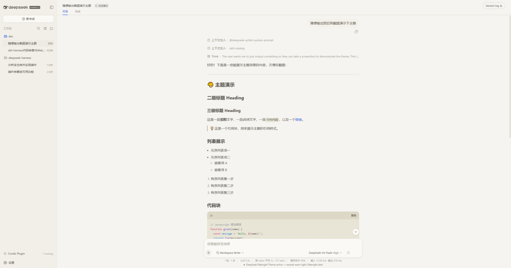
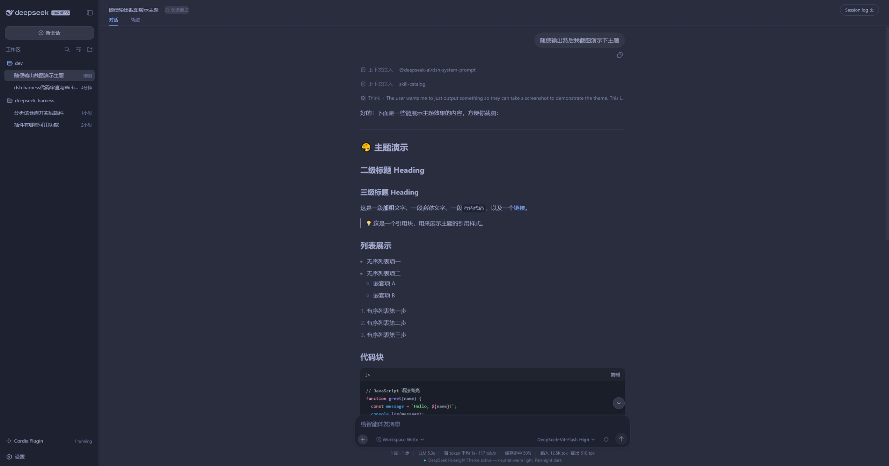

# DeepSeek Palenight Theme

A theme for the **dsh Harness Web UI**, delivered in two forms:

1. **Persistent dsh bundle (recommended)** — `package.json` declares
   `dsh.bundle.patch` + `dsh.client`, so installing the package into a dsh
   profile makes the theme part of the host composition: it is served at
   `/plugins/dsh-palenight-theme/client.js`, listed in `window.__DSH_BOOT__`,
   and **survives host restarts** (same mechanism as `@liustack/modlens`).
2. **Dynamic Cordis plugin** — the original form (`plugin/client.js` +
   `plugin/host.js`), activated per-session via `cordis_define`/`cordis_run`;
   it dies with the process and is only kept for reference.

Both forms stack a token layer over the active theme — no rebuild of the
harness shell is needed.

- **Dark mode** — Community Material Theme *Palenight*: indigo `#292D3E`
  surfaces, periwinkle text `#A6ACCD`, teal accent `#80CBC4`.
- **Light mode** — warm neutral: parchment `#F5F4F0`, warm grey text `#4F4B45`,
  teal accent `#00897B`.
- **Code blocks** get clear contrast in both modes.
- **~100 theme variables** covered (surfaces, tabs/headers, inputs, menus,
  text tiers, borders, buttons, interactive states, code, scrollbars).

## Preview

| Light | Dark |
| --- | --- |
|  |  |

## How it works

The dsh web frontend exposes a `theme` client service. `overrideTokens(source,
tokens)` stacks a per-token CSS-variable layer on top of the active theme:

```js
theme.overrideTokens('deepseek-palenight-theme', {
  '--dsw-alias-bg-base': { light: '#F5F4F0', dark: '#292D3E' },
  '--dsw-alias-brand-primary': { light: '#00897B', dark: '#80CBC4' },
  // ... ~100 tokens total
})
```

The browser half (`plugin/client.js`) applies the layer and registers small UI
(run-card panel, composer status line). The host half (`plugin/host.js`)
registers two package-private RPC handlers (`demo/ping`, `demo/hello`) and a
model-visible demo tool (`demo_greet`) to prove both halves are live.

## Activation (persistent bundle form — survives restarts)

The package is a dsh **bundle**: `package.json` declares `dsh.bundle.patch`
(its `cordis.patch.yml` row) and `dsh.client` (the web client bundle). Install
it so the dsh profile can resolve it:

1. **Resolve the package from the profile.** Either install it with pnpm in
   the profile directory (`dsh plugin --profile web add dsh-palenight-theme`,
   once published), or — for a local checkout — copy the package directory
   into the profile's dependency store and register it:
   - copy to `~/.dsh/profiles/node_modules/dsh-palenight-theme/`
   - add `"dsh-palenight-theme": "1.0.0"` to `dependencies` in
     `~/.dsh/profiles/web/package.json`
   - append `dsh-palenight-theme` to `dsh.profile.bundles` in the same file
2. **Restart dsh.** The row `- id: dsh-palenight-theme` composes into the host
   tree, and the client-modules registry adds
   `/plugins/dsh-palenight-theme/client.js` to the boot manifest
   (`dsh.client.platform: web`, `immediately: true`).
3. **The theme applies at every boot.** Switch dsh Appearance to
   Light/Dark/System — both palettes are themed.

To remove: drop the dependency and bundle entry, then restart.

> **Activation gate.** The client bundle declares `inject: ['theme']`, so the
> plugin activates only after the `theme` service (provided by
> `@deepseek-ai/dsh-client-ui-theme`) is available. Do not remove it: with
> `inject: []` the `immediately: true` bundle runs before `ui-theme` provides
> the service, `ctx.get('theme')` is `undefined`, and the token layer silently
> never applies.
>
> **Hot updates.** `dsh-client-hmr` watches served bundle files, so replacing
> `plugin/client-module.js` (same package, new content hash) reaches the graph
> without a host restart.

## Activation (dynamic form, deprecated — dies on restart)

1. `cordis_define` a new Plugin (`kind: new`, any `idPrefix`), pasting
   `plugin/host.js` as `code.host` and `plugin/client.js` as `code.client`.
2. `cordis_run` the returned `pluginId`/`packageId` (`mode: run`).
3. Approve the browser-side `cordis/request-run` prompt (client code only runs
   after you approve it).
4. The theme applies immediately. Switch dsh Appearance to Light/Dark/System —
   both palettes are themed.

To revert: `cordis_stop <pluginId>` restores the default theme and removes all
effects (badge, cards, tools). `cordis_undefine` removes it permanently.

## Repository layout

```
dsh-palenight-theme/
├── README.md            This file
├── README.zh-CN.md      中文说明
├── LICENSE              MIT
├── package.json         Bundle manifest: dsh.bundle.patch + dsh.client
├── cordis.patch.yml     Host row insert (- id: dsh-palenight-theme)
└── plugin/
    ├── client-module.js Persistent bundle: browser half (token layer only,
    │                    module protocol, inject: ['theme'])
    ├── host-module.js   Persistent bundle: minimal host row (no-op)
    ├── client.js        Dynamic form: browser half (theme + demo UI)
    └── host.js          Dynamic form: host half (RPC handlers + demo tool)
```

## Notes

- Both halves are **plain JavaScript** (no TS/JSX/import). The client uses
  `React.createElement` only.
- `Theme.listTokens` exposes only 13 tokens; the frontend actually consumes
  ~100. `overrideTokens` accepts any token name (only the `{ light, dark }`
  pair shape is validated), so the full set is overridable.
- Dark palette values are taken from the Community Material Theme *Palenight*
  VS Code extension (`equinusocio.vsc-community-material-theme-1.4.7`), whose
  license governs those colors; the code here is MIT.

## License

MIT — see [LICENSE](LICENSE).
